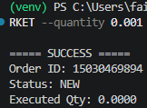
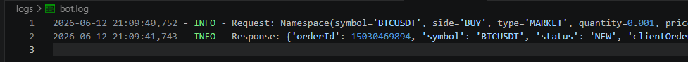

# Binance Futures Testnet Trading Bot

A command-line Python application that places Market and Limit orders on Binance Futures Demo Environment (USDT-M).

## Features

* Place MARKET orders
* Place LIMIT orders
* Supports BUY and SELL orders
* Command-line interface using argparse
* Input validation
* Logging support
* Exception handling
* Environment variable configuration using `.env`
* Binance Futures Demo API integration

---

## Project Structure

```text
TRADINGBOT/
│
├── bot/
│   ├── __init__.py
│   ├── client.py
│   ├── orders.py
│   ├── validators.py
│   └── logging_config.py
│
├── logs/
│
├── .env.example
├── .gitignore
├── cli.py
├── requirements.txt
└── README.md
```

## Installation

```bash
git clone <(https://github.com/KatroxF/assignment_tradingbot/tree/master)>
cd TRADINGBOT

python -m venv venv
venv\Scripts\activate

pip install -r requirements.txt
```

## Environment Variables

Create a `.env` file:

```env
API_KEY=YOUR_API_KEY
API_SECRET=YOUR_API_SECRET
```

## Usage

### Market Order

```bash
python cli.py --symbol BTCUSDT --side BUY --type MARKET --quantity 0.001
```

### Limit Order

```bash
python cli.py --symbol BTCUSDT --side SELL --type LIMIT --quantity 0.001 --price 120000
```

## Example Successful Execution

```text
===== SUCCESS =====

Order ID: 15030469894
Status: NEW
Executed Qty: 0.0000
```
## Screenshots

### CLI Output



### Log File



## Validation Rules

* Side must be BUY or SELL
* Order type must be MARKET or LIMIT
* Quantity must be greater than 0
* LIMIT orders require a price

## Logging

Logs are stored in:

```text
logs/bot.log
```

The application logs:

* API requests
* API responses
* Validation failures
* Runtime errors
* Binance API exceptions

## Error Handling

The application handles:

* Invalid user input
* Missing parameters
* Authentication failures
* Network failures
* Binance API exceptions

## Testing Status

Successfully tested with Binance Futures Demo API credentials.

Verified:

* API authentication
* Account balance retrieval
* CLI argument parsing
* Market order placement
* Response processing
* Logging functionality

## Assumptions

* User has valid Binance Futures Demo API credentials.
* API credentials are stored in a `.env` file.
* Application is executed from the project root directory.


